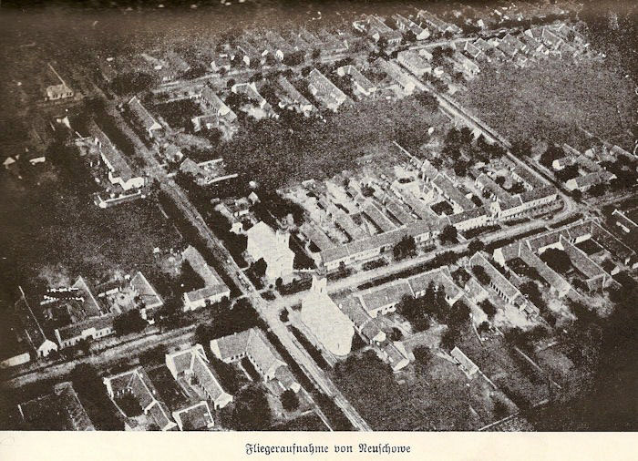

Schowe was one of many Yugoslavian villages settled by ethnic Germans in the late 1700s.  It is where my father's family is from. At the end of WWII, the populace either fled, were put into concentration camps established by the Yugoslavians or sent to Russian labor camps.  Those that survived scattered throughout Germany and the United States. You can read about the "Danube Swabians" [here](https://en.wikipedia.org/wiki/Danube_Swabians).  

While most traces of German presence in what is now Serbia have been scrubbed away, we know much about Schowe from surviving records, particularly the [1944 census](http://dvhh.org/schowe/resources/residentsH.html) and ["1961 Heimatbuch"](http://dvhh.org/schowe/resources/residentsA.html) compiled by the last mayor of Schowe.  Most usage of these records is by individuals looking for their personal family history.  I thought it would be interesting to take a broad view of the data, as well.  The data as presented is a bit messy and required a lot of cleaning.  It's still not perfect but I was able to get the data into a useful table containing the following items:

```{r echo=FALSE, message=FALSE, warning=FALSE}
# devtools::install_github("https://github.com/rstudio/fontawesome.git")
#devtools::install_github("hrbrmstr/waffle")
library(tidyverse)
library(reshape2)
library(ggthemes)
library(waffle)
library(wordcloud)
library(extrafont) # for waffle glyphs
# extrafont::font_import()
loadfonts(device="pdf",quiet = TRUE)
load("data/schowe_residents_1944.rdata")
names(schowe_residents_1944) %>% enframe(name = NULL,value="Extracted Facts") %>% knitr::kable()
```
Few rows are have all pieces of data.  

## Population
What were demographics of the town before the end of the war?

Schowe was a village of about 2,500 souls.
```{r echo=FALSE, warning=FALSE}
schowe_residents_1944 %>%
#  filter(gender != "unknown") %>% 
  group_by(gender) %>%
  summarize(count = n(),age = round(1944-mean(as.numeric(born),na.rm = TRUE),1)) %>%
  knitr::kable(format.args = list(big.mark=","))
```

What was the population of Schowe by street? Here are the top 10 streets.
```{r echo=FALSE, warning=FALSE}
schowe_residents_1944 %>% group_by(village,street) %>% 
  summarize(population=n()) %>% arrange(desc(population)) %>% 
  head(10) %>% 
  knitr::kable(format.args = list(big.mark=","))

```

## Names

These German villages, small and surrounded by Yugoslavians, were fairly insular.  Marriage among cousins was common so there is not a lot of surname diversity.  There were 250 Hallers in the village. There were 23 Jakob Hallers and 29 Elisabeth Hallers!  Things must have been confusing at the church picnic.  The word clouds below show relative frequency of names as larger type.
```{r echo=FALSE, warning=FALSE, fig.height= 3}
name_freq <- schowe_residents_1944 %>% 
  count(last_name) %>% 
  arrange(desc(n))

#pal <- brewer.pal(9,"BrBG")[-(1:4)]
set.seed(12)
wordcloud(name_freq$last_name,name_freq$n,
          scale=c(3,.5),
          max.words = 100,colors = "forestgreen")


```

```{r echo=FALSE, warning=FALSE, fig.height=3}
name_freq <- schowe_residents_1944 %>%
  filter(gender != "unknown") %>% 
  count(first_name,gender) %>% 
  acast(first_name ~ gender, value.var = "n", fill = 0)


name_freq %>%
  comparison.cloud(colors = c("#F8766D", "#00BFC4"),
                   max.words = 100,
                   title.size = 1,
                   scale=c(3.0,0.5))
```

Here are the most common marriage parings.
```{r echo=FALSE, warning=FALSE,fig.height=2}
name_freq <- schowe_residents_1944 %>%
  filter(!is.na(maiden_name)) %>% 
  select(last_name,maiden_name) %>% 
  apply(1,sort) %>% 
  t() %>% 
  as_tibble() %>% 
  mutate(Marriage = paste0(V1,"-",V2)) %>%
  count(Marriage,name="Couples") %>% 
  arrange(desc(Couples))


knitr::kable(name_freq[1:20,])
```

## Households

Number of people per household.
```{r echo=FALSE, warning=FALSE,fig.align='left'}
residents_per_house <- schowe_residents_1944 %>% 
  filter(street != "unknown") %>% 
  mutate(address = paste(village,house,street)) %>% 
  count(address) %>% 
  arrange(desc(n))

residents_per_house %>%
  ggplot(aes(n)) + geom_histogram(binwidth = 1,color = "black") + 
  labs(title = "Village of Schowe, 1944: Occupants per House",
       x = "Number of Occupants",
       y = "Number of Houses",
              caption = "Source: Heimatbuch der Gemeinde Schowe - 1961")
```


## Religion 
There were four churches in the town.  Two massive Lutheran churches, Reformed and Evangelical, faced each other in the center of town.  I can only speculate about the competition between the pastors for best sermon each Sunday.
```{r echo=FALSE,fig.width= 4}

```

Source: [dvhh.org](http://dvhh.org/schowe/history/history.htm)

In addition there was a Catholic church and a Jewish synagogue.  As you might imagine, after five years of Nazi rule, there were no Jews listed in the 1944 census.  The locations of all four churches are visible from Google Street View.  Interestingly, all are vacant lots today.

```{r echo=FALSE}
schowe_residents_1944 %>% count(faith,name="count") %>% arrange(desc(count)) %>%
  knitr::kable(format.args = list(big.mark=","))
```

## Ethnic Cleansing of Schowe 

During a chaotic few weeks in October 1944, the German army retreated westward, the Yugoslavian Partisans and Russians advanced, and many villagers fled.  Some stayed. What was their fate?  The Heimatbuch lists the fate of most of the residents.  If there is no death date in the Heimatbuch, but there is a last location that is not a camp, I classify them as "expelled."  Note that people may have spent time in the camps and survived (like my great aunt) so are thus counted as expelled.  "Died" is usually in one of the Yugoslavian concentration camps or in Russia so I break that out as a separate category.
```{r echo=FALSE, message=FALSE, warning=FALSE}
fates_tab <- schowe_residents_1944 %>% group_by(fate) %>% 
  summarize(count=n()) %>% 
  arrange(desc(count))

fates_tab_summary <- fates_tab %>%
  mutate(fate = as.character(fate)) %>% 
  mutate(fate = ifelse(count < 10,"violent death",fate)) %>% 
  group_by(fate) %>% 
  summarise(count_div_10 = sum(count)/10) %>%
  arrange(desc(count_div_10))

fates_waffle_vector <- fates_tab_summary$count_div_10

names(fates_waffle_vector) <- paste(fates_tab_summary$count_div_10*10,fates_tab_summary$fate)

waffle::waffle(fates_waffle_vector,
               use_glyph = "male",
               glyph_font = "FontAwesome",
               glyph_size = 4.5,
               glyph_font_family = "FontAwesome",
               flip = FALSE) + 
  labs(title = "Fate of the Schower after WWII",
       caption = "Source: Heimatbuch der Gemeinde Schowe - 1961",
       x="1 body = 10 lives") + 
  scale_fill_manual(values=c("orange","black","darkgrey","slategrey","darkred","blue","purple","red","white"),
                    aesthetics = "colour", name = NULL) +
  NULL

```
```{r echo=FALSE}
fates_tab %>%
  knitr::kable(format.args = list(big.mark=","))
```

A large fraction of the village population was sent to concentration camps in Yugoslavia or labor camps in Russia and died there.  An unknown fraction of those counted as "expelled" went through the camps and survived. 
```{r echo=FALSE, warning=FALSE}
camps <- schowe_residents_1944 %>% group_by(last_location) %>% 
  filter(str_detect(last_location,"Lager|Rußland") & fate != "expelled") %>% 
  summarize(count=n()) %>% 
  arrange(desc(count)) %>% 
  mutate(last_location = ifelse(count<10,"Other Lagers",last_location)) %>% 
  group_by(last_location) %>% 
  summarize(deaths=sum(count))
camps %>%
  knitr::kable(format.args = list(big.mark=","))
```

Among the residents whose death year is specified, in what years were the deaths concentrated?  While the fates of most residents are in the table, only a few have the year of death so this is a small subset of all the deaths.
```{r echo=FALSE, warning=FALSE}
schowe_residents_1944 %>% group_by(fate) %>% 
  filter(died != "unknown") %>% 
  summarize(avg_died=as.integer(mean(as.numeric(died)))) %>%
  knitr::kable()
```

```{r echo=FALSE, message=FALSE, warning=FALSE}
camps_waffle_vector <- camps$deaths/10
names(camps_waffle_vector) <- paste(camps$last_location,camps$deaths)

waffle::waffle(camps_waffle_vector,               
               use_glyph = "male",
               glyph_font = "FontAwesome",
               glyph_size = 7,
               glyph_font_family = "FontAwesome",
               flip = FALSE,
               rows = 4) + 
  labs(title = "Schower Deaths in the Camps after WWII",
       caption = "Source: Heimatbuch der Gemeinde Schowe - 1961",
       x="1 body = 10 lives") + 
  scale_fill_manual(values=c("black","slategrey","darkred","red","white"),
                    aesthetics = "colour", name = NULL)
```

My great aunt chose not to flee with her daughter, presumably to care for her mother.  The choice was fatal for her daughter, Elisabeth and mother, Theresia.  Only my great aunt survived to emigrate to Cleveland in the '50s.
 
33 villagers were sent to Russia and died there.  4 of the 33 were women, aged 20,20,20 and 26. Among them was Elisabeth.  Theresia died in Lager Jarek at the age of 79.

```{r echo=FALSE, fig.pos="h",out.width=2}
knitr::include_graphics("img/lilla_poth_1940.jpg")
```

Elisabeth Poth about 1940. Photo by the Johann Pataki studio in Neu Schowe.  Johann Pataki also died in a camp.

```{r echo=FALSE, warning=FALSE}
schowe_residents_1944 %>% 
  mutate(born =  ifelse(born == "unknown","1844",born)) %>% 
   mutate(age_in_1944=1944-as.numeric(born)) %>% 
   filter(str_detect(last_location,"Lager|Rußland") & str_detect(fate,"died")) %>% 
# #  mutate(last_location = ifelse(str_detect(last_location,"Rußland|Jarek"),last_location,"Other Lagers")) %>% 
  group_by(age_in_1944) %>%
  ggplot(aes(age_in_1944,fill=fate)) +
  geom_histogram(binwidth = 10,color = "black") +
  scale_fill_manual(values = c("slategrey","darkgrey","orangered"),name=NULL) +
  labs(title="Schowe Villagers: Deaths in Camp by Age",
        subtitle = "The youth were sent to Russia. The old did not survive the camps.",
       caption = 'Note: Age "100" means "unknown"\nSource: Heimatbuch der Gemeinde Schowe - 1961",
')
```

Among those who survived expulsion, most wound up scattered thoughout Germany but the most popular single destination, by a wide margin, was Cleveland, Ohio, USA.  Cleveland is home to a large Danube Swabian community that was established before and after WWI.  Many of my family came to Cleveland during this time.
```{r echo=FALSE, warning=FALSE}
locations <- schowe_residents_1944 %>% group_by(last_location) %>% 
  filter(fate == "expelled") %>% 
  summarize(count=n()) %>% 
  arrange(desc(count))
locations %>%
  knitr::kable(format.args = list(big.mark=","))
```
